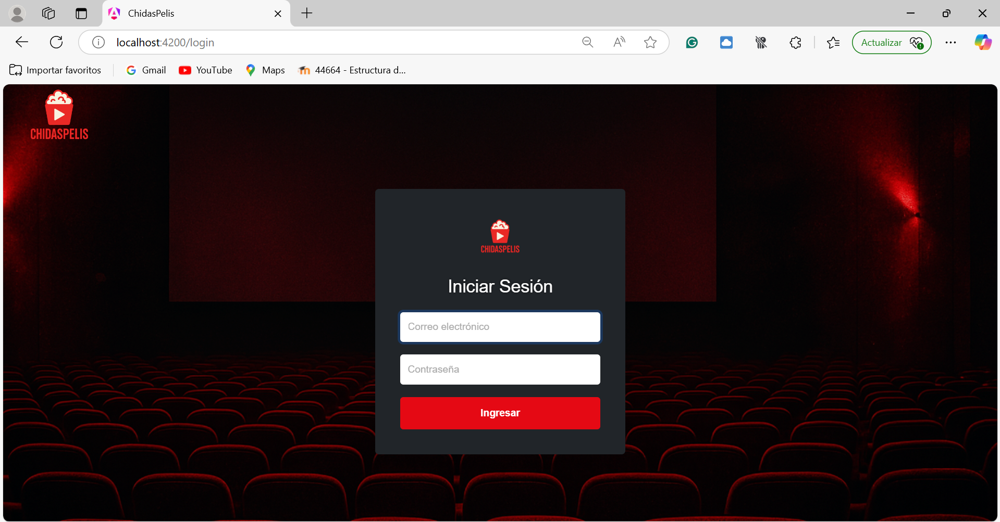
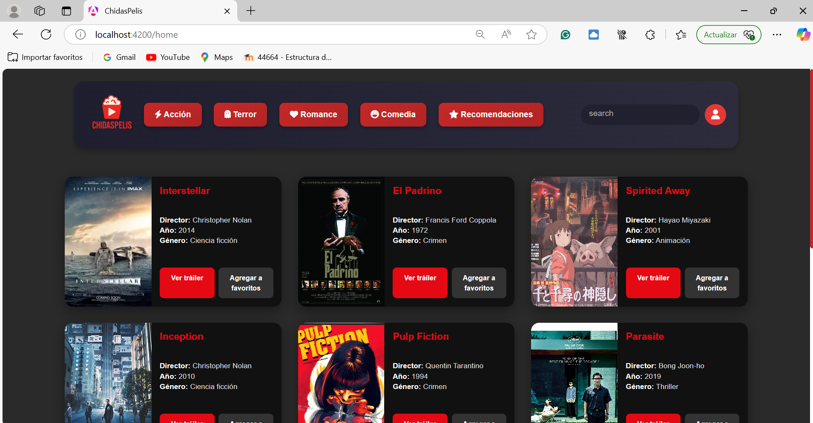

# ChidasPelis

Este una migracion de un proyecto creado en vanilla js y fue migrado a   [Angular CLI](https://github.com/angular/angular-cli) version 18.2.18 el objetivo general del proyecto es crear una plataforma de streaming

### Fucnionalidades

- Cargada dinamica de informacion desde Json
- Diseno responsivo
- Vista inicio sesion simulada
- Agrega peliculas a favoritos


##### Cómo Descargar Repositorio

1. Abre la consola o terminal en tu computadora.
2. Copia el enlace del repositorio desde GitHub.
3. Ejecuta el siguiente comando en la consola:

   ```bash
   git clone [URL_DEL_REPOSITORIO]
   ```


### Capturas de pantalla Login



### Captura de pantalla Home



### Dependecia utilizadas

## Dependencias y Bibliotecas

- [`@angular/common/http@18.2.18`](https://angular.io/api/common/http/HttpClient): Utilizado para realizar peticiones HTTP y obtener los datos del archivo `peliculas.json`.
- [`bootstrap@5.3.3`](https://getbootstrap.com/docs/5.3/getting-started/introduction/): Utilizado para los estilos y diseño responsivo del proyecto.

---

### Instalación de dependencias

```bash
npm install bootstrap@5.3.3
```

### Descripcion de como lo hice y problemas conocidos

La migración se me facilitó un poco porque mi proyecto en vanilla ya lo tenía estructurado en componentes. Sin embargo, los principales problemas que tuve fueron debido a que nunca había trabajado con Angular. Estaba aprendiendo y desarrollando el proyecto al mismo tiempo.

Aunque ya tenía noción de cómo funcionan los componentes, usarlos en Angular tiene su manera particular de hacerlo. Afortunadamente, una vez que le entiendes, todo se va haciendo más fácil.

Otro conflicto que tuve fue al utilizar `HttpClient`, ya que nunca lo había usado antes. También batallé un poco al organizar mis imágenes, porque en varias ocasiones ponía rutas incorrectas.

### Retrospectiva

#### ✅ ¿Qué hice bien?

Logré cumplir con los objetivos, ya que pude realizar la migración del proyecto a Angular exitosamente.

#### ❌ ¿Qué no salió bien?

Tuve dificultades al organizar mis archivos y al adaptarme a una nueva tecnología, enfrentándome a varias singularidades propias de Angular que no conocía.

#### 🔁 ¿Qué puedo hacer diferente?

Creo que puedo mejorar aún más mi trabajo fortaleciendo mis conocimientos en Angular y practicando más para familiarizarme con su estructura y herramientas.
