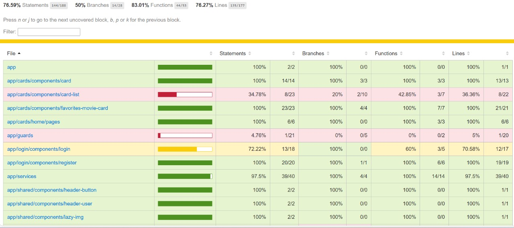
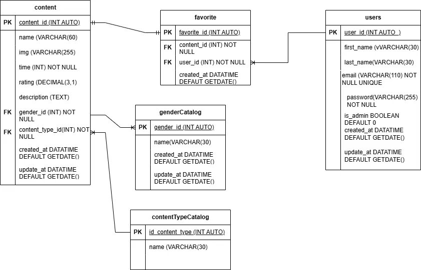
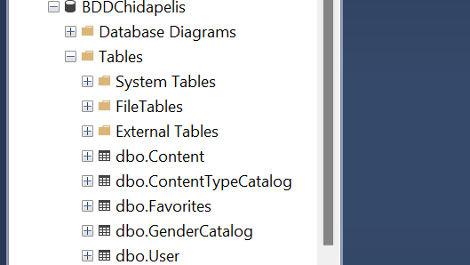
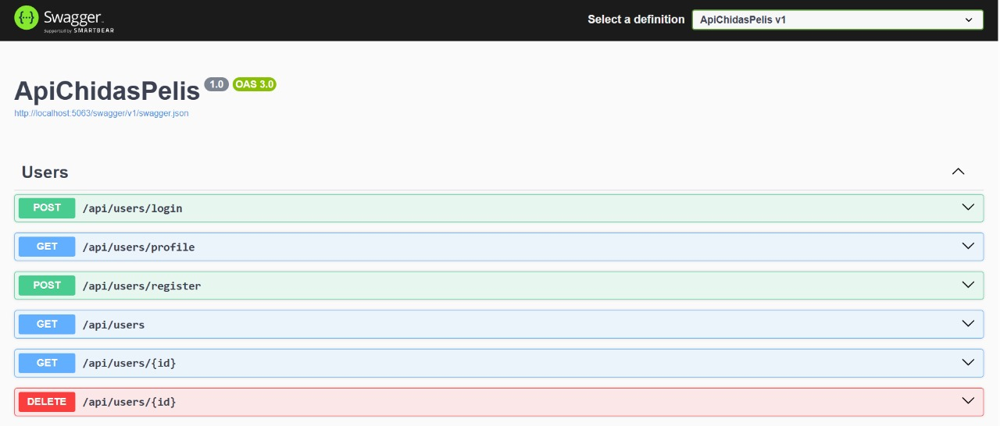

# ChidasPelis

Este una migracion de un proyecto creado en vanilla js y fue migrado a   [Angular CLI](https://github.com/angular/angular-cli) version 18.2.18 el objetivo general del proyecto es crear una plataforma de streaming

### Fucnionalidades

- Cargada dinamica de informacion desde Json
- Diseno responsivo
- Vista inicio sesion simulada
- Agrega peliculas a favoritos

##### Cómo Descargar Repositorio

1. Abre la consola o terminal en tu computadora.
2. Copia el enlace del repositorio desde GitHub.
3. Ejecuta el siguiente comando en la consola:

   ```bash
   git clone https://github.com/Fernando19921/ChidasPelis.git
   ```

### Capturas de pantalla Login


### Captura de pantalla Home


### Covarge



### Diagrama Entidad Relacion



### Microsoft Sql Server



### Codigo Sql
[Script Sql](script.sql)
### Modelado de la base de datos y reglas de negocio y operaciones
[Archivo Completo de Modeladodo BDD](modeladoBDD.md)

### Swagger



### Dependecia utilizadas

## Dependencias y Bibliotecas

- [`@angular/common/http@18.2.18`](https://angular.io/api/common/http/HttpClient): Utilizado para realizar peticiones HTTP y obtener los datos del archivo `peliculas.json`.
- [`bootstrap@5.3.3`](https://getbootstrap.com/docs/5.3/getting-started/introduction/): Utilizado para los estilos y diseño responsivo del proyecto.

---

### Instalación de dependencias

```bash
npm install bootstrap@5.3.3
```

### Descripcion de como lo hice y problemas conocidos

###### Migracion a angular

La migración se me facilitó un poco porque mi proyecto en vanilla ya lo tenía estructurado en componentes. Sin embargo, los principales problemas que tuve fueron debido a que nunca había trabajado con Angular. Estaba aprendiendo y desarrollando el proyecto al mismo tiempo.

Aunque ya tenía noción de cómo funcionan los componentes, usarlos en Angular tiene su manera particular de hacerlo. Afortunadamente, una vez que le entiendes, todo se va haciendo más fácil.

Otro conflicto que tuve fue al utilizar `HttpClient`, ya que nunca lo había usado antes. También batallé un poco al organizar mis imágenes, porque en varias ocasiones ponía rutas incorrectas.

###### Pruebas Unitaria

Las pruebas unitarias realizadas con Jasmine me resultaron algo desafiantes, ya que nunca antes había trabajado con pruebas tan elaboradas en mi proyecto. Aunque tenía algo de conocimiento previo utilizando Jest, encontré ciertas dificultades debido a aspectos del testing que aún desconozco. Sin embargo, esta experiencia me permitió aprender y mejorar mis habilidades en este ámbito.

###### Modelado de la base de datos

El modelado de la base de datos no me resultó tan complicado, ya que apliqué las reglas de negocio que debía cumplir. Consideré las operaciones que se realizarían sobre la base de datos, así como el tipo de datos y las relaciones entre las distintas entidades.

#### Integración del Frontend con el Backend (.NET)
La integración de mi API desarrollada en .NET fue un desafío, principalmente por la falta de práctica con C#, un lenguaje que nunca había utilizado antes. Desarrollar una API en ese lenguaje y consumirla desde el frontend representó una experiencia complicada, pero valiosa, que me permitió aprender y adaptarme rápidamente a nuevas tecnologías.


### Retrospectiva

### ✅ ¿Qué hice bien?

Logré cumplir con los objetivos del proyecto, ya que pude  **migrar exitosamente la aplicación a Angular** . Además, implementé pruebas unitarias que cubren todas las funcionalidades del componente, alcanzando un **90% de cobertura de código** (`code coverage`). Esto garantiza un alto nivel de confiabilidad y calidad en el funcionamiento del módulo.

Logré estructurar una (`base de datos`) que se ajusta a las necesidades de mi proyecto, incorporando todas las operaciones necesarias que podrán ser implementadas. Esto me garantiza una base sólida, funcional y preparada para su correcto desempeño.

También logré un buen funcionamiento del (`backend`), estructurando adecuadamente los endpoints y organizando su manejo de forma clara y eficiente. Además, implementé seguridad en el inicio de sesión mediante **JWT** (`JSON Web Tokens`) desde el lado del servidor, lo que garantiza una autenticación segura y confiable para los usuarios.


#### 🧪 Funcionalidades cubiertas en los tests:

* Agregado a favoritos
* Lectura desde `localStorage`
* Actualización del estado visual
* Protección contra SSR (`localStorage` solo en navegador)
* Login
* Registro de usuario

---

### ❌ ¿Qué no salió tan bien?

Tuve dificultades al **organizar los archivos del proyecto** y al adaptarme a Angular, ya que me Tuve algunas dificultades al momento de organizar los archivos del proyecto y adaptarme a Angular, ya que me enfrenté a varias características propias del framework que desconocía. Sin embargo, estas barreras representaron una gran oportunidad para aprender y mejorar mis habilidades en esta tecnología.

Otra de las principales complicaciones fue durante la creación de la base de datos, especialmente al trabajar con **T-SQL**, ya que no estaba completamente familiarizado con su sintaxis y funciones. Esto requirió tiempo extra de investigación y prueba.

Además, la implementación del **API** fue un nuevo desafío para mí como desarrollador, ya que fue la primera vez que trabajé en la integración completa entre el frontend y el backend. A pesar de la dificultad inicial, esta experiencia me permitió adquirir una visión más amplia y práctica del desarrollo full stack.

#### 🔁 ¿Qué puedo hacer diferente?

Considero que puedo mejorar aún más mi trabajo fortaleciendo mis conocimientos en Angular, practicando con mayor frecuencia para familiarizarme mejor con su estructura, herramientas y buenas prácticas. También es importante para mí dedicar más tiempo a profundizar en T-SQL, con el fin de manejar con mayor seguridad la creación y gestión de bases de datos en SQL Server.

En cuanto al backend, me gustaría seguir perfeccionando mis habilidades en .NET y C#, ya que fue mi primera experiencia desarrollando una API en este entorno. Fortalecer mi dominio en esta área me permitirá implementar arquitecturas más robustas, aplicar principios SOLID de forma más natural y desarrollar APIs más seguras y escalables.


