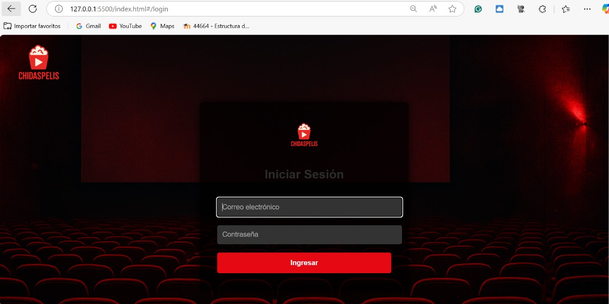
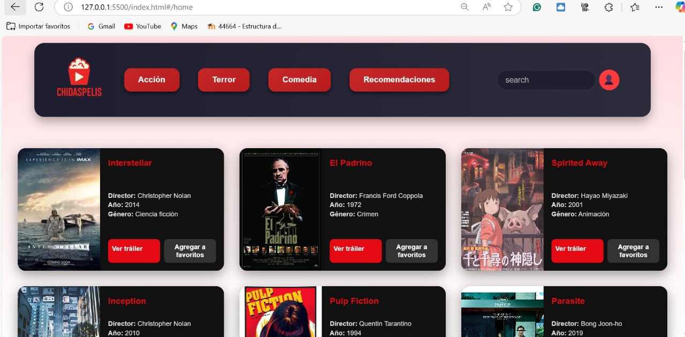
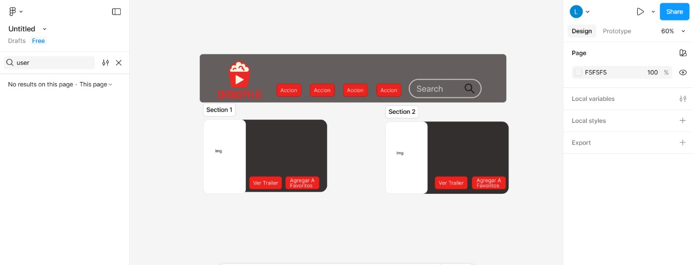

# 🎬 CHIDASPELIS

##### Descripcion

Chidaspelis es un aplicacion web de straming de pelicula construida con vanilla Javascrip utilizando una estructura SPA.

##### Fucnionalidades

- Cargada dinamica de informacion desde Json
- Diseno responsivo
- Vista inicio sesion simulada
- Agrega peliculas a favoritos

##### Capturas de pantalla

**Vista Login**



**Vista Home**



##### Mockup




##### Cómo Descargar Repositorio

1. Abre la consola o terminal en tu computadora.
2. Copia el enlace del repositorio desde GitHub.
3. Ejecuta el siguiente comando en la consola:

   ```bash
   git clone [URL_DEL_REPOSITORIO]
   ```

##### Descripcion Como Lo Hice


La forma en que decidí desarrollar mi proyecto fue un poco diferente, utilizando una arquitectura tipo  **SPA (Single Page Application)** . En esta, también usé **componentes** para formar mi página de manera dinámica.

Además, creé una carpeta llamada `helpers`, donde encapsulo funciones que podría estar reutilizando mucho en el proyecto. En este caso, tengo encapsulada una  **petición con Axios** , la cual utilizo para hacer una solicitud local a mi archivo `peliculas.json`, que contiene toda la información relacionada con las películas.

También manejo una carpeta `img`, donde tengo todas las imágenes que utilizo en el proyecto.

Tengo una carpeta `router`, donde creé un archivo específico para manejar las **rutas** y mostrar las distintas  **vistas** . También tengo un archivo `app.js`, que se encarga de  **ejecutar mis componentes** , y un archivo `index.js`, que contiene un evento para ejecutar `App` al cargar el documento. En ese mismo archivo, agregué otro evento en el objeto `window` para detectar el cambio de **hash** (o ruta) y volver a ejecutar `App`. Luego, `App` llama a las rutas, y estas muestran la vista correspondiente según la ruta en la que se encuentre el usuario.

En mi proyecto también desarrollé un  **inicio de sesión** , por ahora simulado. Lo único que se valida es que los campos no estén vacíos para poder acceder a la vista principal.

Como tal, en mi proyecto solo tengo un archivo `index.html`, el cual contiene una estructura simple de HTML. La única diferencia es que tiene un  **div contenedor** , donde siempre se cargará todo dinámicamente. La razón por la que decidí hacerlo así es por la **rapidez de carga** al mostrar el contenido. Aunque sé que, a nivel de SEO, esta forma  **no es la más óptima.**

##### Problemas Conocidos

Al realizar mi proyecto de esta forma, me enfrenté a dos problemáticas que fueron las que más trabajo me costaron.

La primera fue que, al crear todo en componentes, literalmente hablamos de que es como un  **rompecabezas** . Si no lo armas bien, las cosas no quedan como uno quiere.

La segunda fue el **manejo de las rutas** y nuevamente la  **ejecución de los componentes** . Aquí el mayor problema que tuve fue que, al estar en la vista de Login e iniciar sesión para mostrar la vista principal,  **una vista se encimaba con la otra** . Esto pasaba porque todo el contenido se inserta en un `div` contenedor. Al iniciar sesión, todo el HTML de la vista del login se tenía que borrar para insertar la nueva vista, pero lo que sucedía era que **no se borraban los elementos del login** cuando se insertaba la vista principal, y por eso  **se encimaba el contenido** .

El problema estaba ahí y también en la forma en la que yo armaba mis componentes. Desde un principio los armaba en `App`, y eso me causaba que, al borrar la vista de login, también se borrara la vista principal, porque ya estaba formada desde antes.

Al final, lo solucioné armando mis vistas  **directamente en las rutas** , y dejando que `App` solo se encargue de llamar al `router`.


##### Retrospectiva


* **¿Qué hice bien?**

  Cumplí con los requerimientos solicitados en el sprint, así como con el funcionamiento óptimo de mi página web.
* **¿Qué no salió bien?**

  La forma de construir las vistas con los componentes y la dificultad para manejar las rutas.
* **¿Qué puedo hacer diferente?**

  Pude haber incorporado un **scroll infinito** para seguir mostrando más películas cada vez que el usuario llegara al final de la página. También pude haber guardado sus preferencias en  **localStorage** , para tener un apartado con las películas favoritas del usuario.
