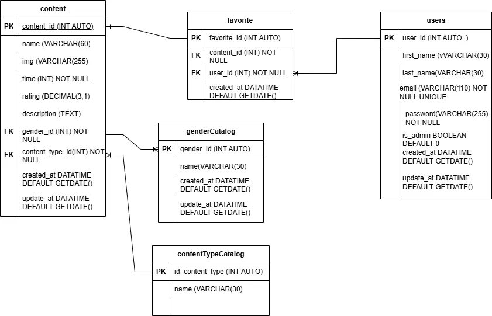

# Modelado De ChidasPelis

## Listado De Entidades

---

### User (ED)

- `user_id` (pk)  
- `first_name`  
- `last_name`  
- `email`  
- `password`  
- `is_admin` BOOLEAN DEFAULT 0  
- `created_at` DATETIME DEFAULT GETDATE()  
- `updated_at` DATETIME DEFAULT GETDATE()

---

### GenderCatalog (EC)

- `id_gender` (pk)
- `name`
- `created_at` DATETIME DEFAULT GETDATE()
- `updated_at` DATETIME DEFAULT GETDATE()

---

### ContentTypeCatalog (EC)

- `id_content_type` (pk)
- `name`

---

### Content

- `content_id` (pk)
- `name`
- `img`
- `time`
- `rating`
- `release_year`
- `description`
- `gender_id` (fk)
- `content_type_id` (fk)
- `created_at` DATETIME DEFAULT GETDATE()
- `updated_at` DATETIME DEFAULT GETDATE()
- FOREIGN KEY (`gender_id`) REFERENCES `GenderCatalog(id_gender)`
- FOREIGN KEY (`content_type_id`) REFERENCES `ContentTypeCatalog(id_content_type)`

---

### Favorites

- `id_favorite` (pk)
- `user_id` (fk)
- `content_id` (fk)
- `created_at` DATETIME DEFAULT GETDATE()
- FOREIGN KEY (`user_id`) REFERENCES `User(user_id)`
- FOREIGN KEY (`content_id`) REFERENCES `Content(content_id)`

---

### Relaciones

1. Una **content** pertenece a un **género** → `1:N`
2. Una **content** tiene un **tipo de contenido** (película o serie) → `N:1`
3. Un **usuario** puede tener muchos **favoritos** → `1:N`
4. Un **favorito** apunta a una sola **content** (que puede ser película o serie) → `1:1`

### Modelo Relacion De La BDD

### Reglas De Negocio

#### Todos los usuarios:
- Registrarse (crear usuario)
- Iniciar sesión (validar credenciales)
- Leer su propia información
- Actualizar datos personales
- Cambiar contraseña

#### Solo para administradores:
- Leer todos los usuarios
- Leer un usuario en particular
- Habilitar/Inhabilitar un usuario
- Eliminar un usuario

#### GenderCatalog
- Crear un **género**
- Leer todos los **géneros**
- Actualizar un **género**
- Eliminar un **género**
- Validar que no se repita el nombre del **género**

#### ContentTypeCatalog
- Crear un tipo de **contenido**
- Leer todos los tipos de **contenido**
- Actualizar un tipo de **contenido**
- Eliminar un tipo de **contenido**
- Validar que no se repita el nombre del tipo de **contenido**

#### content

- Crear una **content**
- Leer **content**
- Actualizar una **content**
- Eliminar **content**
- Validar que no se repita un **content**

